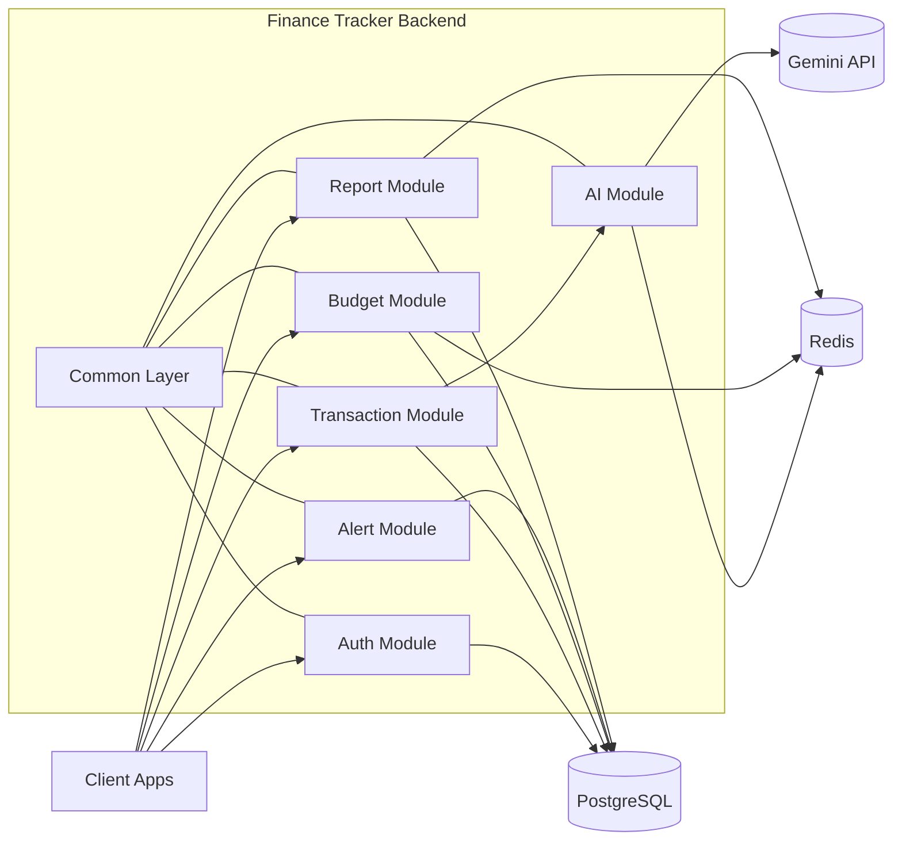

# AI-Powered Personal Finance Tracker

A modular-monolith Spring Boot backend for personal finance management with AI-assisted categorization, fraud checks, budgeting, alerts, and reporting.


---

## Table of Contents

- [Project Description](#project-description)
- [Screenshots](#screenshots)
- [Features](#features)
- [Tech Stack](#tech-stack)
- [Architecture Diagram](#architecture-diagram)
- [How to Run Locally (Docker Compose)](#how-to-run-locally-docker-compose)
- [How to Run Locally (Maven)](#how-to-run-locally-maven)
- [API Documentation](#api-documentation)
- [Postman Collection](#postman-collection)
- [Testing and CI/CD](#testing-and-cicd)
- [Project Structure](#project-structure)

## Project Description

Most finance apps only store transactions. This project focuses on decision support:

- Track income and expenses with secure JWT auth
- Detect unusual spending and potential fraud signals
- Monitor category budgets and generate warning alerts
- Produce report summaries and category trends
- Use AI to categorize transactions and provide savings advice

The backend is structured as independent internal modules (`user`, `transaction`, `budget`, `alert`, `ai`, `report`) inside one deployable service.


## Features

- JWT-based authentication with access and refresh tokens
- User-scoped transaction CRUD with ownership validation
- Budget limit monitoring per month/category
- Alert generation for budget warnings and suspicious activity
- AI category suggestion and AI-powered finance advice
- Redis-backed caching to reduce repeated heavy operations
- Flyway schema migrations for controlled database evolution
- OpenAPI/Swagger docs and Actuator observability endpoints

## Tech Stack

### Backend

- Java 21
- Spring Boot 4.0.5
- Spring Security + JWT (`jjwt`)
- Spring Data JPA + Flyway
- Spring AI (Google GenAI starter)

### Data and Infrastructure

- PostgreSQL 16
- Redis 7
- Docker + Docker Compose
- GitHub Actions (test + Docker Hub deploy)

## Architecture Diagram



## How to Run Locally (Docker Compose)

### 1. Clone repository

```bash
git clone https://github.com/mostafa2742002/finance-tracker.git
cd finance-tracker
```

### 2. Optional environment variables

AI features require a Gemini key. You can run core endpoints without it.

```bash
export GEMINI_API_KEY="your-gemini-api-key"
export GEMINI_MODEL="gemini-2.5-flash"
export JWT_SECRET="your-base64-jwt-secret"
```

### 3. Build and start all services

```bash
docker compose up --build -d
```

Services exposed on host:

- App: `http://localhost:8081`
- PostgreSQL: `localhost:5437`
- Redis: `localhost:6377`

### 4. Verify health and inspect logs

```bash
curl http://localhost:8081/actuator/health
docker compose logs -f app
```

### 5. Stop services

```bash
docker compose down
```

## How to Run Locally (Maven)

If you prefer running the app outside Docker:

1. Start PostgreSQL and Redis locally
2. Configure credentials in `application-dev-secrets.yaml` or environment variables
3. Run:

```bash
./mvnw clean spring-boot:run
```

## API Documentation

- Swagger UI: http://localhost:8081/swagger-ui.html
- OpenAPI JSON: http://localhost:8081/v3/api-docs

## Postman Collection

- `postman/finance-tracker-cycle.postman_collection.json`
- `postman/finance-tracker-local.postman_environment.json`

## Testing and CI/CD

### Run tests locally

```bash
./mvnw test
```

### GitHub Actions workflow

- Runs tests on all pushes and PRs targeting `main`
- Deploys Docker image to Docker Hub only when:
  - tests pass
  - event is a push to `main`

Required GitHub secrets for Docker deployment:

- `DOCKERHUB_USERNAME`
- `DOCKERHUB_TOKEN`

## Project Structure

```text
src/main/java/com/financetracker/
  common/
  user/
  transaction/
  budget/
  alert/
  ai/
  report/

src/main/resources/
  application.yaml
  application-dev.yaml
  application-prod.yaml
  db/migration/

postman/
  finance-tracker-cycle.postman_collection.json
  finance-tracker-local.postman_environment.json
```

## Security Notes

- Never commit real API keys or tokens.
- Use environment variables or GitHub Secrets for all sensitive values.
